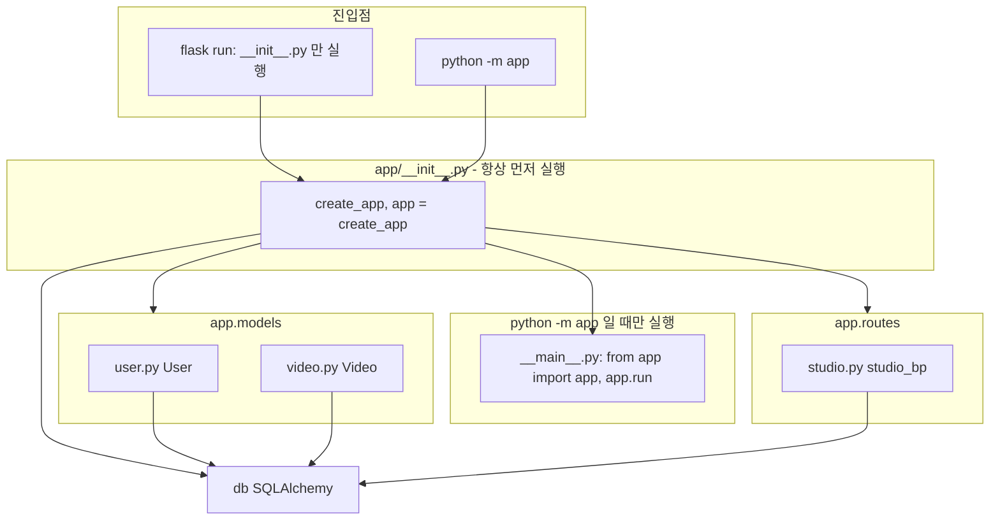
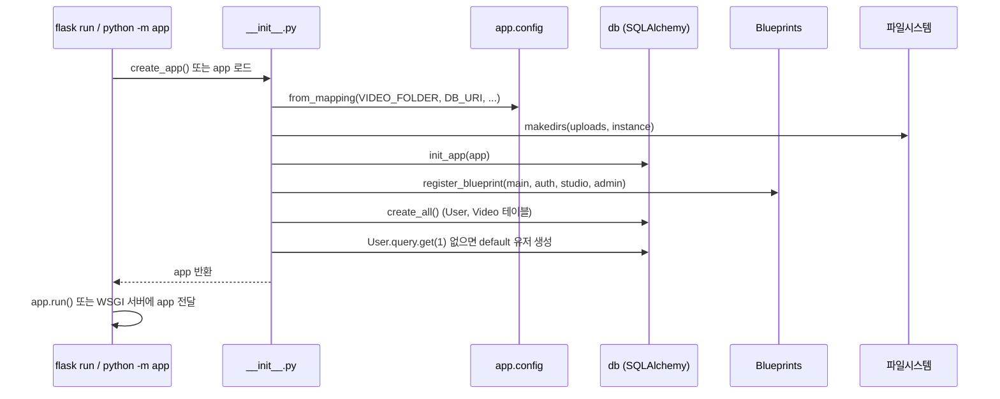
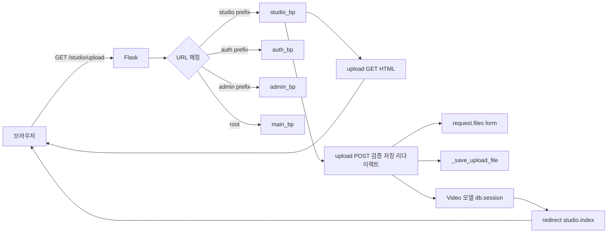
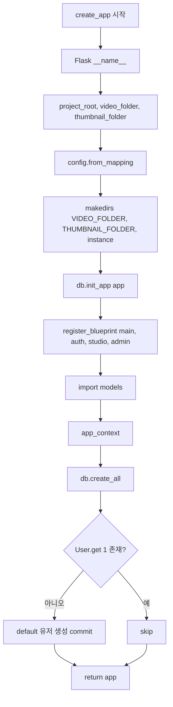
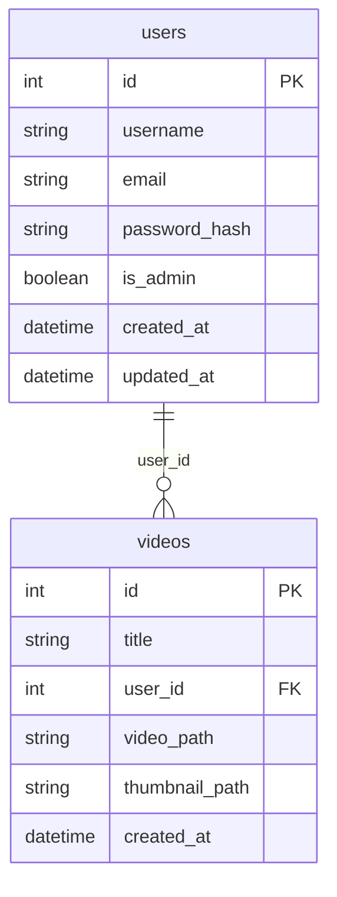
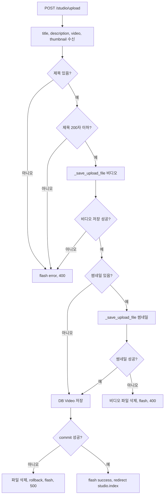

# 10. 코드 주석·개념·동작 원리·다이어그램·문법·사용법

`app/__init__.py`, `__main__.py`, `models/`, `routes/` 각 파일의 코드 주석, 기본 개념, 동작 원리, Mermaid 개요도·순서도, 역할, 기본 문법, 예시 코드, 사용법을 정리한다.

> **참고**: `__pycache__/` 는 Python이 생성하는 바이트코드 캐시 디렉터리로, 소스 수정 시 자동 갱신되며 버전 관리 대상이 아니다.

---

## 1. 전체 구조 개요

### 1.1 실행 순서와 동작 원리 (정확한 순서)

**항상 `__init__.py` 가 먼저 실행됩니다.** `__main__.py` 가 먼저 실행되는 것이 아닙니다.

| 실행 방법 | 실행 순서 | 동작 원리 |
|-----------|-----------|-----------|
| **flask run** (FLASK_APP=app) | ① `app/__init__.py` 만 실행 | Flask CLI가 `app` 패키지를 import → 패키지 로드 시 **__init__.py** 가 한 번 실행됨. 이때 `app = create_app()` 이 실행되어 앱 객체가 만들어진다. **__main__.py 는 실행되지 않음.** Flask CLI가 이미 만들어진 `app` 을 가져다 WSGI 서버를 띄움. |
| **python -m app** | ① `app/__init__.py` → ② `app/__main__.py` | Python이 `app` 패키지를 **먼저 로드** → 패키지 로드 시 **__init__.py** 실행 (create_app(), app = create_app()). 그 다음 `-m app` 에 따라 **__main__.py** 를 메인 스크립트로 실행 → `from app import app` 후 `app.run()` 호출. |

**요약**
- **__init__.py**: 패키지(`app`)가 import/로드될 때 **항상 가장 먼저** 실행됨. 여기서 `db`, `create_app()`, `app = create_app()` 이 정의됨.
- **__main__.py**: `python -m app` 일 때만 실행되며, **__init__.py 실행 이후** 에 실행됨. `from app import app` 으로 이미 __init__.py 에서 만든 `app` 을 가져와 `app.run()` 만 호출함.

### 1.1-2 디렉터리·모듈 관계 (Mermaid)



- **flask run**: `A → __init__` 만 수행. __main__.py 는 실행되지 않음.
- **python -m app**: `B → __init__ → __main__` 순서. __init__.py 로드 후 __main__.py 가 실행됨.

### 1.2 앱 기동 순서도 (Mermaid)



### 1.3 HTTP 요청 → 라우트 → 응답 (Mermaid)



---

## 2. app/**init**.py

### 2.1 역할

- Flask **앱 팩토리**: `create_app()` 으로 앱 인스턴스 생성.
- **설정**: DB URI, 업로드 폴더·용량·확장자, `DEFAULT_USER_ID`.
- **확장 초기화**: `db = SQLAlchemy()`, `db.init_app(app)`.
- **Blueprint 등록**: main, auth, studio, admin.
- **DB·기본 데이터**: `create_all()`, user_id=1 없으면 default 유저 생성.
- **모듈 레벨**: `app = create_app()` → `flask run` / `FLASK_APP=app` 시 이 앱이 로드됨.

### 2.2 기본 개념·동작 원리

- **앱 팩토리**: 앱을 함수로 만드는 패턴. 테스트·멀티 인스턴스에서 앱을 여러 개 만들 수 있음.
- **동작**: `create_app()` 호출 시 Flask 앱 생성 → config 설정 → 폴더 생성 → db와 앱 연결 → Blueprint 등록 → `app_context` 안에서 테이블 생성·기본 유저 확인 → 앱 반환.

### 2.3 코드 주석 요약

| 라인(대략) | 코드                                                                                     | 주석 요약                                                    |
| ---------- | ---------------------------------------------------------------------------------------- | ------------------------------------------------------------ |
| 1          | `"""Flask 앱 팩토리 ..."""`                                                              | 모듈 docstring: 업로드·DB 포함 앱 팩토리                     |
| 8-9        | `db = SQLAlchemy()`                                                                      | DB 확장 객체. 나중에 `init_app(app)` 로 앱에 연결            |
| 12-14      | `create_app():` `app = Flask(__name__)`                                                  | 앱 인스턴스 생성                                             |
| 16-19      | `project_root`, `video_folder`, `thumbnail_folder`                                       | 프로젝트 루트 기준 업로드 경로 계산                          |
| 21-39      | `app.config.from_mapping(...)`                                                           | SECRET_KEY, DB URI, 업로드 폴더·용량·확장자, DEFAULT_USER_ID |
| 41-46      | `os.makedirs(..., exist_ok=True)`                                                        | 업로드·instance 폴더 없으면 생성                             |
| 48         | `db.init_app(app)`                                                                       | SQLAlchemy를 현재 앱에 바인딩                                |
| 50-58      | `from app.routes...` `register_blueprint`                                                | Blueprint 4개 등록                                           |
| 60-75      | `from app import models` `with app.app_context():` `db.create_all()` `User.query.get(1)` | 모델 로드 후 테이블 생성, user_id=1 없으면 default 유저 생성 |
| 79-80      | `app = create_app()`                                                                     | flask run / FLASK_APP=app 시 로드되는 앱                     |
| 83-88      | `if __name__ == "__main__":` `app.run(...)`                                              | 직접 실행 시(예: python -m app) 개발 서버 기동               |

### 2.4 create_app() 흐름 (Mermaid)



### 2.5 기본 문법·예시·사용법

**문법**

- `Flask(__name__)`: 현재 모듈 이름으로 앱 생성.
- `app.config.from_mapping(**kwargs)`: 설정 키-값 일괄 설정.
- `db.init_app(app)`: Flask-SQLAlchemy 확장을 앱에 연결.
- `app.register_blueprint(bp)`: Blueprint 등록.
- `with app.app_context():`: 앱 컨텍스트 안에서 DB 등 앱 의존 작업 수행.

**예시**

```python
def create_app():
    app = Flask(__name__)
    app.config.from_mapping(SECRET_KEY="dev", SQLALCHEMY_DATABASE_URI="sqlite:///db.sqlite")
    db.init_app(app)
    app.register_blueprint(some_bp)
    with app.app_context():
        db.create_all()
    return app
```

**사용법**

- 터미널: `set FLASK_APP=app` 후 `flask run` → `app` 모듈의 `app` 객체 사용.
- 또는 `python -m app` → `__main__.py` 가 `from app import app` 후 `app.run()` 호출.

---

## 3. app/**main**.py

### 3.1 역할

- `python -m app` 실행 시 진입점. `app` 패키지를 실행 가능하게 함.

### 3.2 동작 원리

- `python -m app` → Python이 `app/__main__.py` 를 실행. `if __name__ == "__main__"` 에서 `from app import app` 후 `app.run(...)` 호출.

### 3.3 코드 주석 요약

| 내용                                               | 설명                                     |
| -------------------------------------------------- | ---------------------------------------- |
| `"""WeTube 실행 진입점 ..."""`                     | python -m app 으로 실행할 때 사용        |
| `from app import app`                              | **init**.py 에서 만든 app 인스턴스       |
| `app.run(debug=True, host="127.0.0.1", port=5000)` | 개발 서버 기동 (디버그, 로컬, 5000 포트) |

### 3.4 사용법

- 프로젝트 루트(ch05)에서: `python -m app`

---

## 4. app/models/**init**.py

### 4.1 역할

- 모델 패키지: `User`, `Video` 를 import 해서 외부에서 `from app.models import User, Video` 로 쓸 수 있게 함.

### 4.2 코드 주석·문법

- 파일 상단 주석: 모델 패키지 – DB 모델 내보내기.
- `__all__ = ["User", "Video"]`: 공개 심볼 정의 (선택).

**예시**

```python
from app.models import User, Video
user = User.query.get(1)
video = Video(title="제목", user_id=1, video_path="x.mp4")
```

---

## 5. app/models/user.py

### 5.1 역할

- **User** 모델: `users` 테이블에 대응. Video의 `user_id` FK 대상. 업로드 시 `DEFAULT_USER_ID`(1) 사용.

### 5.2 기본 개념·동작 원리

- **ORM**: 클래스 속성이 DB 컬럼과 매핑. `db.Model` 상속 시 Flask-SQLAlchemy가 테이블명·컬럼 정보를 읽어 `create_all()` 시 CREATE TABLE 수행.
- **동작**: `User.query.get(1)` → PK 1인 행 조회. `User(username=..., email=..., password_hash=...)` → 인스턴스 생성 후 `db.session.add()` · `commit()` 으로 INSERT.

### 5.3 코드 주석 요약

| 라인  | 코드                              | 주석 요약                                         |
| ----- | --------------------------------- | ------------------------------------------------- |
| 1     | `# 사용자 모델 ...`               | users 테이블, Video FK용                          |
| 8-9   | `class User(db.Model):` docstring | 사용자 – 업로드 시 user_id FK용                   |
| 10    | `__tablename__ = "users"`         | 테이블명 지정                                     |
| 12-20 | `id`, `username`, `email`, ...    | PK, unique, nullable, default, onupdate 설명 가능 |

### 5.4 ER 관계 (Mermaid)



### 5.5 기본 문법·예시

**문법**

- `db.Column(db.Integer, primary_key=True, autoincrement=True)`: 정수 PK, 자동 증가.
- `db.Column(db.String(80), nullable=False, unique=True)`: 문자열, NOT NULL, UNIQUE.
- `default=datetime.utcnow`, `onupdate=datetime.utcnow`: 기본값·수정 시 자동 시간.

**예시**

```python
from app.models import User
from app import db
u = User(username="test", email="test@example.com", password_hash="")
db.session.add(u)
db.session.commit()
```

---

## 6. app/models/video.py

### 6.1 역할

- **Video** 모델: `videos` 테이블. 업로드된 동영상 메타데이터. `video_path`/`thumbnail_path` 는 파일명만 저장, 실제 파일은 config 폴더에 있음.

### 6.2 코드 주석 요약

| 라인 | 코드                                            | 주석 요약                         |
| ---- | ----------------------------------------------- | --------------------------------- |
| 1    | `# 비디오 모델 ...`                             | videos 테이블                     |
| 9    | docstring                                       | 업로드된 동영상 정보              |
| 11   | `__tablename__ = "videos"`                      | 테이블명                          |
| 21   | `db.ForeignKey("users.id", ondelete="CASCADE")` | user 삭제 시 해당 video 행도 삭제 |

### 6.3 기본 문법·예시

**예시**

```python
from app.models import Video
from app import db
v = Video(title="제목", description="설명", video_path="uuid.mp4", thumbnail_path="uuid.jpg", user_id=1)
db.session.add(v)
db.session.commit()
```

---

## 7. app/routes/**init**.py

### 7.1 역할

- routes 패키지 식별. 현재는 주석만 있음(`# Routes package`). Blueprint는 각 `main.py`, `auth.py` 등에서 정의되고 `app/__init__.py` 에서 import 되어 등록됨.

---

## 8. app/routes/admin.py

### 8.1 역할

- **admin_bp**: 관리자 화면 라우트. `/admin`, `/admin/users`, `/admin/videos`, `/admin/comments`, `/admin/database`, `/admin/query`, `/admin/table/<table_name>` 등. DB·백엔드 없이 프론트 템플릿만 렌더. `/admin/login` 은 `auth.login` 으로 리다이렉트.

### 8.2 동작 원리

- `url_prefix="/admin"` 이므로 `@admin_bp.route("/")` → `/admin/`, `@admin_bp.route("/users")` → `/admin/users`.
- `table_view(table_name)`: TABLES 딕셔너리에서 테이블별 columns·sample 데이터를 꺼내 `admin/table_view.html` 에 넘김.

### 8.3 코드 주석 요약

| 위치              | 설명                                        |
| ----------------- | ------------------------------------------- |
| 모듈 docstring    | 관리자 라우트 – 프론트 전용, DB/백엔드 없음 |
| `table_view` 내부 | 프론트 전용: 테이블별 구조 및 샘플 데이터   |

### 8.4 기본 문법·예시

**예시**

```python
admin_bp = Blueprint("admin", __name__, url_prefix="/admin")
@admin_bp.route("/")
def index():
    return render_template("admin/index.html")
@admin_bp.route("/login")
def login():
    return redirect(url_for("auth.login"))
```

---

## 9. app/routes/auth.py

### 9.1 역할

- **auth_bp**: 인증 관련 페이지. `/auth/login`, `/auth/register`, `/auth/profile`. 로그인·회원가입·프로필은 프론트 전용(DB·백엔드 없음).

### 9.2 코드 주석·예시

- 모듈 docstring: 인증 라우트 – 로그인/회원가입 페이지만. DB·백엔드 없음.
- `url_for("auth.login")` → `/auth/login`.

**예시**

```python
auth_bp = Blueprint("auth", __name__, url_prefix="/auth")
@auth_bp.route("/login")
def login():
    return render_template("auth/login.html")
```

---

## 10. app/routes/main.py

### 10.1 역할

- **main_bp**: 메인 페이지. `/`(홈), `/watch/<video_id>`, `/search`, `/subscriptions`, `/tag/<tag>`, `/user/<username>`. 프론트 전용, DB 없이 템플릿·request.args 만 사용.

### 10.2 코드 주석·동작

- `request.args.get("q", "").strip()`: 검색 쿼리. 있으면 results_count=10, 없으면 0.
- `user_profile(username)`: sample_users 딕셔너리에서 nickname, subs_count 등 꺼내 템플릿에 전달.

**예시**

```python
main_bp = Blueprint("main", __name__)
@main_bp.route("/")
def index():
    return render_template("main/index.html")
@main_bp.route("/search")
def search():
    query = request.args.get("q", "").strip()
    return render_template("main/search.html", query=query, results_count=10 if query else 0)
```

---

## 11. app/routes/studio.py

### 11.1 역할

- **studio_bp**: Studio. `/studio`(인덱스), `/studio/upload`(GET 폼 / POST 업로드 처리), `/studio/edit/<video_id>`.
- 업로드: 제목·비디오 필수, 설명·썸네일 선택 → 검증 → 파일 저장(UUID 파일명) → Video 레코드 저장. 실패 시 파일 삭제·flash·폼 재렌더.

### 11.2 기본 개념·동작 원리

- **파일 업로드**: `request.files.get("video")` 로 FileStorage. 확장자·용량 검사 후 `save_dir` 에 `uuid.uuid4().hex + "." + ext` 로 저장.
- **트랜잭션**: 비디오 저장 → 썸네일 저장(선택) → `db.session.add(video); commit()`. 중간 실패 시 이미 저장한 파일 삭제 후 `rollback()`.

### 11.3 코드 주석 요약

| 라인(대략) | 코드                                           | 주석 요약                                                                     |
| ---------- | ---------------------------------------------- | ----------------------------------------------------------------------------- |
| 1          | `# Studio 라우트 ...`                          | 동영상 관리·업로드                                                            |
| 15-19      | `_allowed_file`                                | 파일 확장자가 허용 목록에 있는지 검사, 빈 filename·None 처리                  |
| 23-28      | `_save_upload_file` docstring                  | 업로드 파일 검증 후 저장. 반환 (저장된\_파일명, None) 또는 (None, 에러메시지) |
| 52-54      | `@studio_bp.route("/")` `@studio_bp.route("")` | /studio, /studio(끝 슬래시 없음) 모두 처리                                    |
| 62-66      | POST 블록                                      | 폼 데이터 수신: title, description, video, thumbnail                          |
| 69-76      | 제목 검증                                      | 제목 필수, 200자 이하                                                         |
| 78-88      | 비디오 검증·저장                               | config에서 폴더·확장자·용량 읽어 \_save_upload_file 호출                      |
| 90-106     | 썸네일(선택)                                   | 실패 시 이미 저장한 비디오 파일 삭제 후 에러 반환                             |
| 108-118    | DB 저장                                        | user_id=config.DEFAULT_USER_ID, Video 생성, add, commit                       |
| 119-134    | except                                         | rollback, 저장된 비디오·썸네일 파일 삭제, flash 에러, 500                     |
| 136-137    | 성공 시                                        | flash success, redirect studio.index                                          |

### 11.4 업로드 처리 순서도 (Mermaid)



### 11.5 기본 문법·예시

**문법**

- `@studio_bp.route("/upload", methods=["GET", "POST"])`: GET·POST 모두 처리.
- `request.method`, `request.form.get("title")`, `request.files.get("video")`.
- `current_app.config["VIDEO_FOLDER"]`, `current_app.config.get("DEFAULT_USER_ID", 1)`.
- `flash("메시지", "error")` / `flash("메시지", "success")`.
- `redirect(url_for("studio.index"))`, `render_template(..., title=title), 400`.

**예시**

```python
@studio_bp.route("/upload", methods=["GET", "POST"])
def upload():
    if request.method == "GET":
        return render_template("studio/upload.html")
    title = (request.form.get("title") or "").strip()
    video_file = request.files.get("video")
    if not title:
        flash("제목을 입력해주세요.", "error")
        return render_template("studio/upload.html", title=title), 400
    video_filename, err = _save_upload_file(video_file, folder, allowed, max_size)
    if err:
        flash(err, "error")
        return render_template("studio/upload.html", title=title), 400
    video = Video(title=title, video_path=video_filename, user_id=current_app.config.get("DEFAULT_USER_ID", 1))
    db.session.add(video)
    db.session.commit()
    flash("동영상이 업로드되었습니다.", "success")
    return redirect(url_for("studio.index"))
```

---

## 12. Mermaid 문법 요약 (본 문서에서 사용)

| 다이어그램      | 용도               | 예시                                           |
| --------------- | ------------------ | ---------------------------------------------- |
| flowchart       | 흐름·구조          | `flowchart TB` / `LR`, `A --> B`, `subgraph`   |
| sequenceDiagram | 시간 순서 상호작용 | `participant`, `->>`, `-->>`                   |
| erDiagram       | ER 관계            | `users \|\|--o{ videos`, `users { int id PK }` |

**노드**

- `[텍스트]`: 사각형
- `(텍스트)`: 둥근 사각형
- `{조건}`: 마름모
- `-->`, `->>`: 화살표 (실선/점선)

**플로우**

- `A --> B`: A에서 B로
- `C --> D{조건}`: 조건 분기
- `K -->|예| L`, `K -->|아니오| M`: 레이블

이 문서는 위 파일들의 코드 주석, 개념, 동작 원리, Mermaid 개요도·순서도, 역할, 문법, 예시, 사용법을 한곳에 모은 참조용이다.
